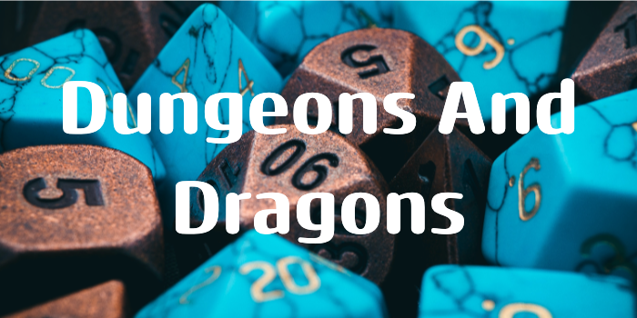
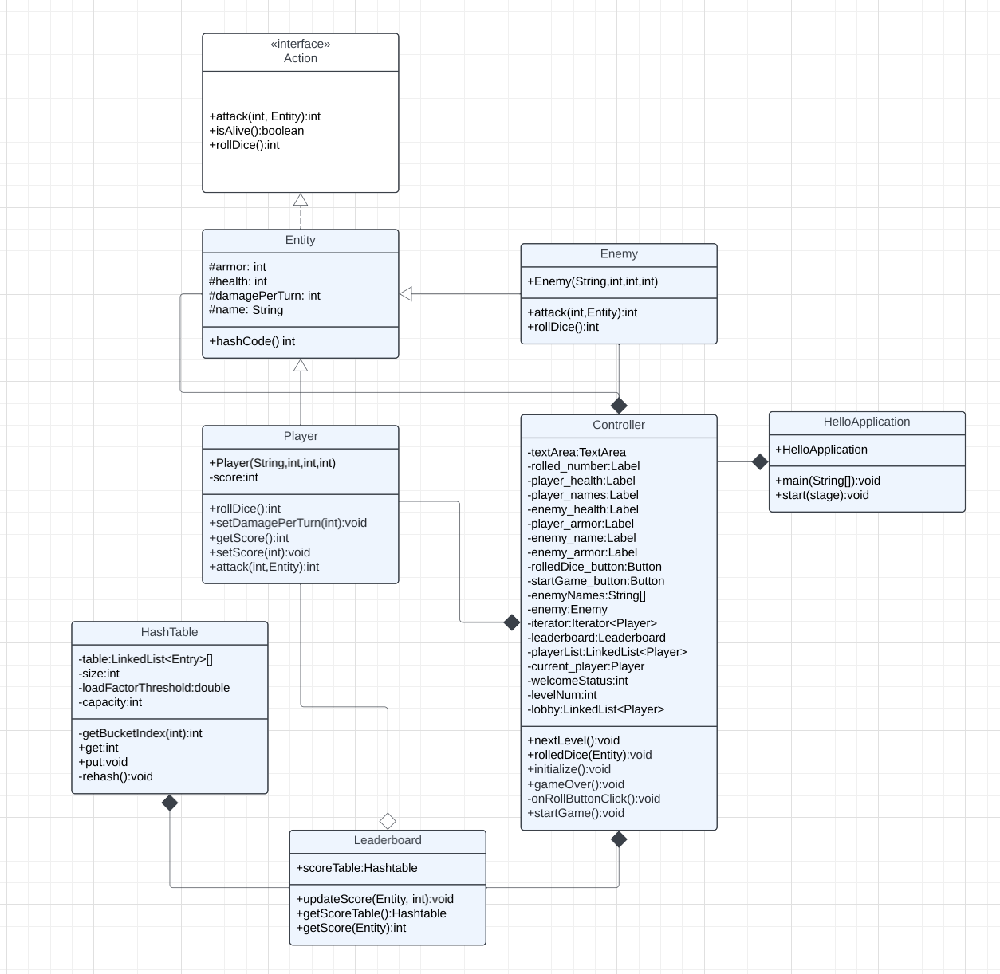
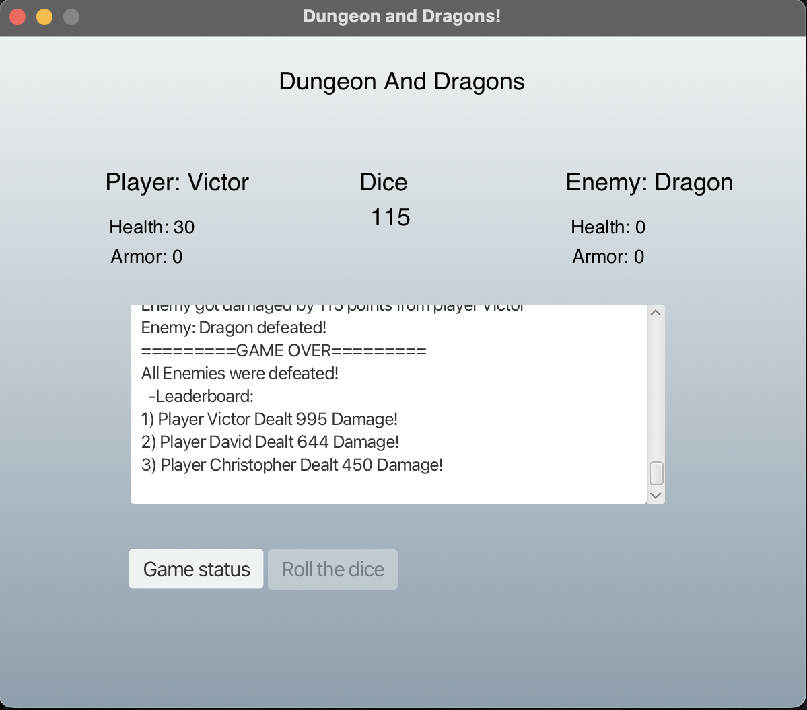
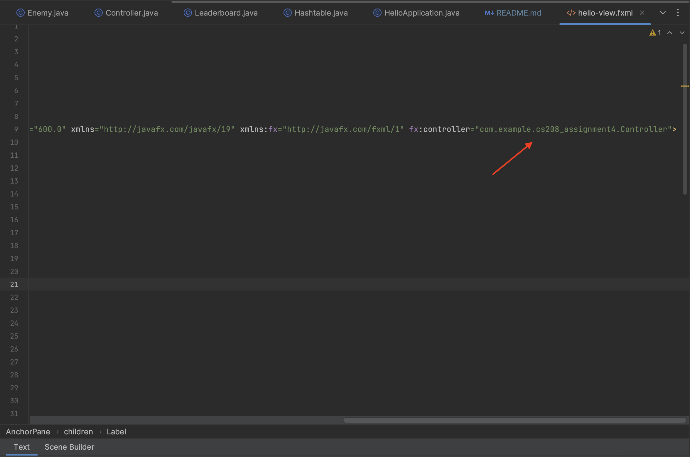

# Dungeons and Dragons

This project game mimics the real Dungeons and Dragons game. It includes the logic of the actual game and mimics the real logic and functionality.

## Table of contents
* [Motivation](#motivation)
* [Summary of approach](#summary-of-approach)
* [Results](#results)
* [What we learned](#what-we-learned)
* [How to use this repository](#how-to-use-this-repository)

<a name="Motivation"><a/>
## Motivation
We decided to challenge ourselves and tried to write a small teamwork game for the first time. Our team was always eager to learn and write a good designed backend game logic.

## Summary of approach

For the first step we decided to draw a UML diagram which we could follow along the way.

The game starts by displaying player and enemy information. Players take turns rolling the dice, attacking the enemy, and dealing damage. When a player's health reaches zero, they are defeated, and the game progresses to the next level. The game continues until all levels are beaten or all players are defeated. The GUI displays messages about the game status, player turns, and enemy attacks.

The Controller class in this code mimic game manages the logic of the game and handles JavaFXML GUI controls. It initializes player and enemy information, sets up the game environment, and defines the game's main mechanics. Players take turns rolling a dice and attacking the enemy, with their stats displayed on the GUI.

Levels are incremented as players advance, increasing enemy stats. Once the maximum level is reached, the game ends, and the leaderboard displays player scores based on damage dealt. The game includes features like armor, health, and damage, and it handles player and enemy interactions through dice rolls. Overall, the Controller class orchestrates the game flow, making it an engaging Dungeons and Dragons inspired experience.

<a name="Results"><a/>
## Results
The final result of our game is the leaderboard.
We have the class Leaderboard which is using a custom implemented Hashtable class. This class Leaderboard takes the final dealt damages of players and inserts all players into the hashtable based on their unique hashcodes. After the insertion, we can observe that the leaderboard sorts and prints the final results of dealt damages in the text area.

<a name="what we learned"><a/>
## What we learned

This was an awesome team work. First of all we learned to combine our skills and efficiently apply our skills into this project to achieve good results within a limited time. We learned to combine our work and deliver a quality merged results.

We improved our knowledge of working with ADTs (Abstract Data Types) such as LinkedList, HashTable and HashMap. At the same time, we learned how to improve existing ADTs by customizing and adding our own features into them.

Finally, we learned how to organize our project and use proper ADTs for specific cases.

<a name="how to use this repository"><a/>
## How to use this repository

Anyone who wants to use this repository would need to download the entire project and store it at a convenient package folder and run it.

Note: Do not change the package name in the code, since the JavaFXML can cause issues running the actual GUI part. The reason of it, is because we have set the fx:controller for the AnchorPane, which is located in the CS208_Assignment4 directory.

## Authors

- [@davprog9](https://www.github.com/davprog9) David
- [@vserra3192](https://www.github.com/vserra3192) Victor
- [@Vrypel](https://www.github.com/Vrypel) Christopher

